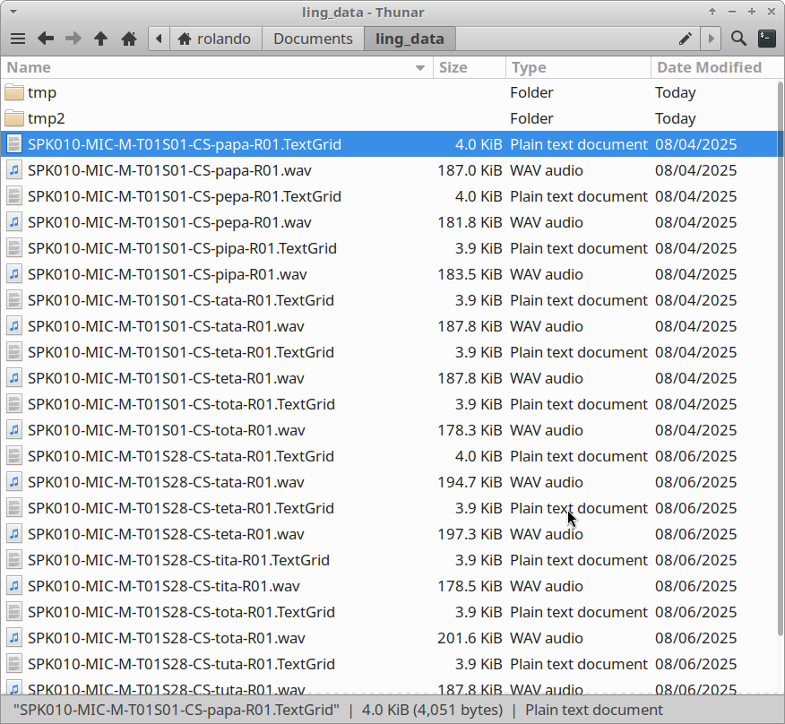
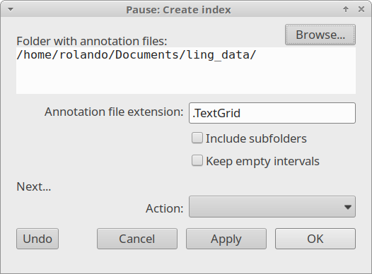
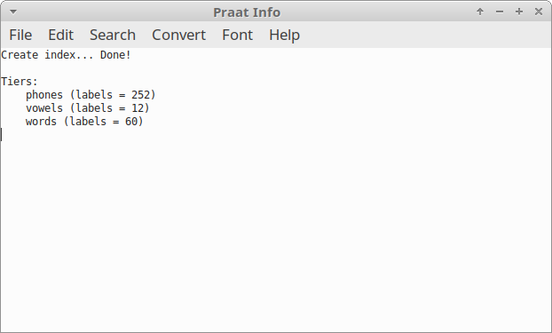
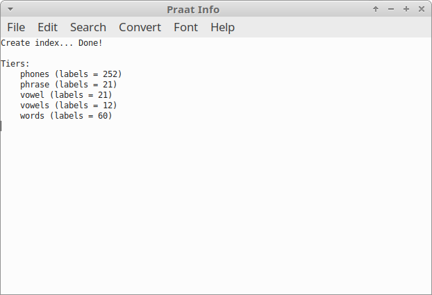

Step 1: Indexing TextGrids
--------------------------

Indexing TextGrid files is the starting point for this plug-in.
When running this operation, Praat will read the TextGrid files in a 
directory and store their content into tables. These tables are used 
internally by the plug-in when searching for data.

Create an index
~~~~~~~~~~~~~~~

In the following example we will index the TextGrid files in the folder
``ling_data`` (:numref:`speaker_001-folder`).

.. _speaker_001-folder:

   A folder containing the audio and TextGrid files to be indexed.

To index this folder, go to the ``Finder > Create index...`` command.
When you click it, a window pops up as shown in :numref:`index_window`.
In the field ``Folder with annotation files`` provide the directory on
your computer. Leave the other options as in :numref:`index_window` 
and click ``Ok``.

.. _index_window:

   The ``Create index...`` window

Once the indexing is complete, the ``Praat Info`` window will display a
message like the one in :numref:`index-result_window`. The message lists all
the tiers grouped by name across your TextGrid files and the total number
of transcribed items (``intervals`` or ``points``) for each one. For
example, the tier ``vowels`` contains 12 labels in total.

.. _index-result_window:

   The ``Praat Info`` window showing the indexing results

.. _TextGrids in subfolders:

Include subfolders
~~~~~~~~~~~~~~~~~~
In the previous case, only the files in the main directory were indexed.
To include TextGrids within subfolders (such as ``tmp`` and ``tmp2``),
check the ``Include subfolders`` option. As shown in 
:numref:`index-result_window2`,  the results are now different from the
previous example because more TextGrid files were included.

.. _index-result_window2:

   The ``Praat Info`` window showing the indexing results

FAQ
~~~

**Do I need to index my files each time Praat starts?**

    No. The plug-in stores the indexed information on the folder
    ``temp`` within the plug-in folder. This folder is managed
    automatically, so your data remains available and ready for use
    every time you start Praat.
 
**When is it necessary to index files again?**

    You should create a new index whenever your annotation 
    files are modified or updated.

**Is there a limit to the number of TextGrids I can index?**

    There is no hard limit; however, the time required to create the
    index will increase with the number and size of your files.
    For very large datasets, we recommend indexing only the folders
    necessary for your current analysis.

**Does indexing modify my original TextGrid files?**

    No. The plug-in only reads your files to extract information.
    Your original TextGrid files remain untouched and are never
    modified by the indexing process.

**What happens if I move my folder to a different location on my computer?**

    If you move your annotation folder, the plug-in will no longer be
    able to locate the files. In this case, you simply need to
    run the ``Create index...`` command again and provide the new folder
    path.

Now you are ready for :doc:`02-search`.
