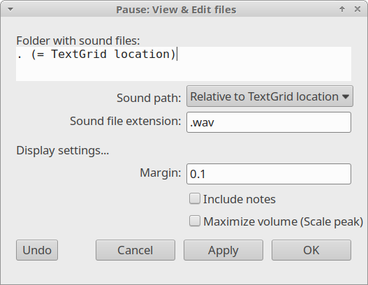
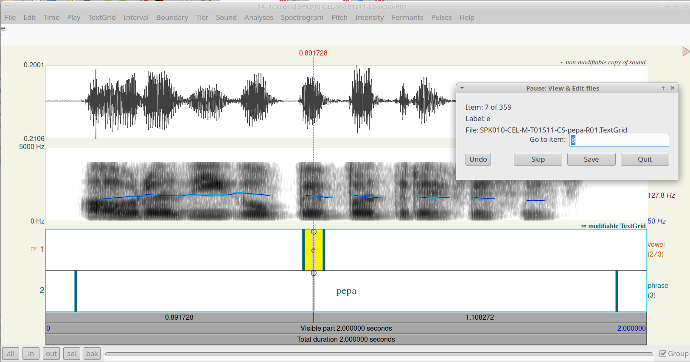

View and Edit
=============

Once a search is performed, you can navigate through the results using
the `View & Edit files` command. This command displays the labels in
the TextGridEditor one by one, along with their corresponding audio file.
A navigation panel allows you to move backward and forward between 
occurrences. You can also make changes to the TextGrid files and save 
them directly from the panel.

To start, ensure you have completed the `Create an index` and `Search`
steps. Then, go to the `View & Edit files` under the submenu
`Praat > Goodies > Finder > Tasks`. A dialog box will appear.

.. _view_and_edit-dialog:

   The `View & Edit files` dialog

The dialog asks for the location of the audio files. Since audio and
TextGrid files are commonly stored in the same directory, 
the default settings can usually be left unchanged. 
Please note that both the TextGrid and audio files must have identical
filenames.

After clicking `OK`, you will see the results one by one, as shown in 
:numref:`view_and_edit-navigate`. In the figure, the TextGridEditor
displays the audio and TextGrid of the results. The matched label is
automatically centered and selected in the Editor. Simultaneously, a
Navigation (Pause) window appears. The Item field shows that you are
viewing result 7 of 359. The Skip button allows you to move to the
next occurrence without saving changes; the next item shown will be
the one indicated in the `Go to item` field (in this case, item 8).
The `Save` button records your changes to the TextGrid before moving
to the next item. Use `Undo` to revert any accidental changes, or `Quit`
to close the session

.. _view_and_edit-navigate:

   Example
