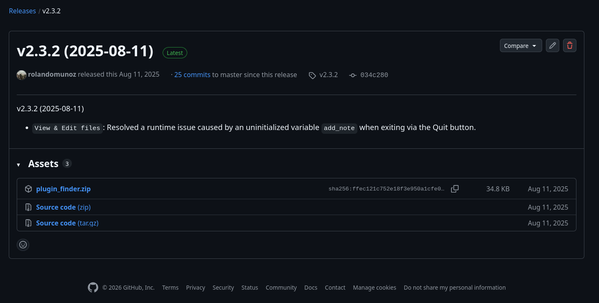

Installation
------------

**Step 1.** Get the latest version of the plug-in at the following `link`_.
On the website, navigate to the **Assets** section and download the ZIP
file ``plugin_finder.zip``.

.. _github-download:

   Download section on GitHub

**Step 2.** Unzip the file to extract the plugin folder. Copy this folder into the
Praat **preferences folder**. This is a directory created after you run
Praat for the first time on your computer and its location depends on
your operating system.

.. tab-set::

    .. tab-item:: Windows
        :sync: windows

        On Windows, the **preference folder** is located at 
        ``C:\Users\[user name]\Praat``. In the :numref:`praat_preferences-win`,
        the plug-in folder has been copied to that directory.

        .. _praat_preferences-win:

        .. figure:: img/praat_preferences-win.png
           :align: center

           The **Praat Preferences** directory on Windows 10

        Within the plug-in folder you should have the following content.

        .. _plugin_folder_win:

        .. figure:: img/plugin_folder-win.png
           :align: center
           
           The plug-in folder

    .. tab-item:: macOS
        :sync: macos

        On Mac, the **preference folder** is located at 
        ``/Users/your user name/Library/Preferences/Praat Prefs/``. 

        .. note::
            The ``Library`` folder is hidden by default on macOS. To 
            find it, open **Finder**, click the **Go** menu while holding
            the **Option (Alt)** key, and select **Library**.

    .. tab-item:: Linux
        :sync: linux

        On Linux, the **preference folder** it is located at
        ``/home/your user name/.praat-dir/``. In the 
        :numref:`praat_preferences-linux`, the plug-in folder has
        already been copied to that directory.

        .. _praat_preferences-linux:

        .. figure:: img/praat_preferences-linux.png
           :align: center

           The **Praat Preferences** directory on Linux (Debian 13)

        Within the plug-in folder you should have the following content.

        .. _plugin_folder_linux:

        .. figure:: img/plugin_folder-linux.png
           :align: center
           
           The plug-in folder

**Step 3.** Finally, check that Praat can recognize the plug-in. Start Praat and
go to ``Praat > Goodies`` in the menu bar. There, you should
be able to see the ``Finder`` submenu as shown in :numref:`plugin_menu`.

    .. _plugin_menu:

    .. figure:: img/finder_menu-linux.png
       :align: center
       
       The plug-in menu

    .. _link: https://github.com/rolandomunoz/plugin_finder/releases/latest

.. note::

    The location of the Praat **preferences folder** could change 
    in Praat 7.xx. Always keep an eye on the section 
    `preferences folder`_ in the Praat manual to see where it is 
    located.

    .. _preferences folder: https://www.fon.hum.uva.nl/praat/manual/preferences_folder.html
